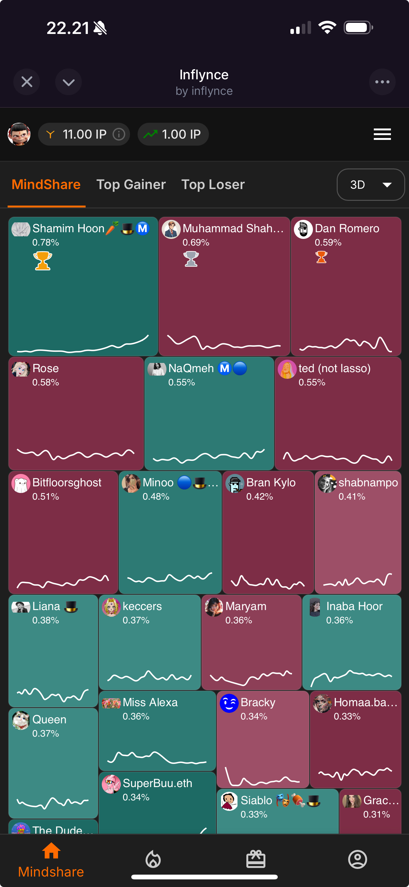
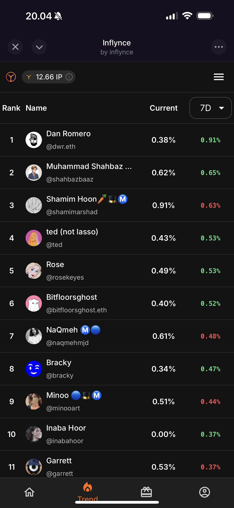
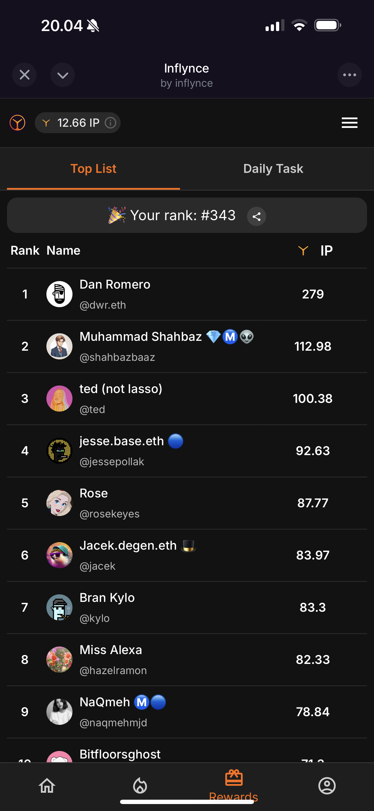
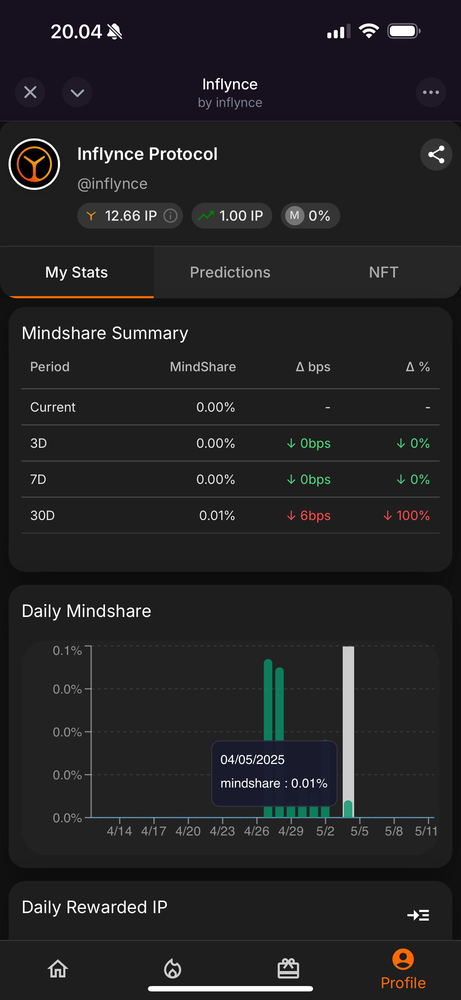
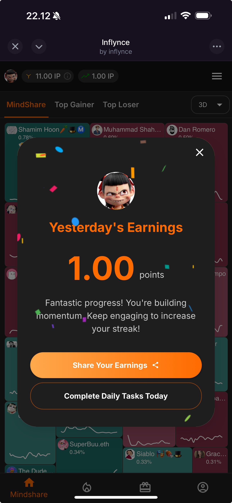
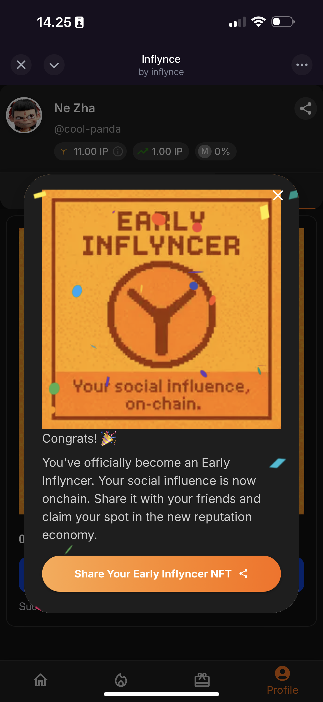
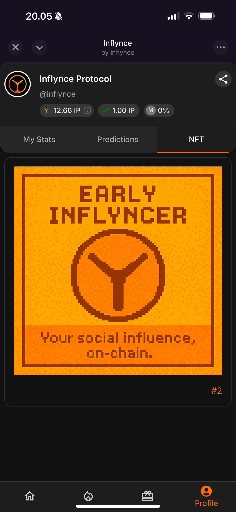
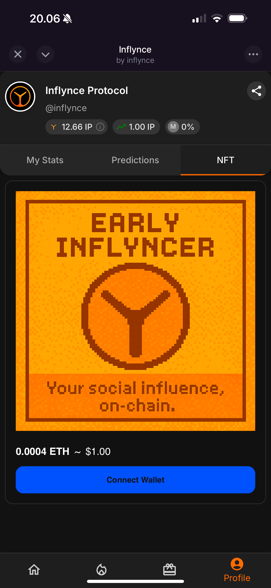
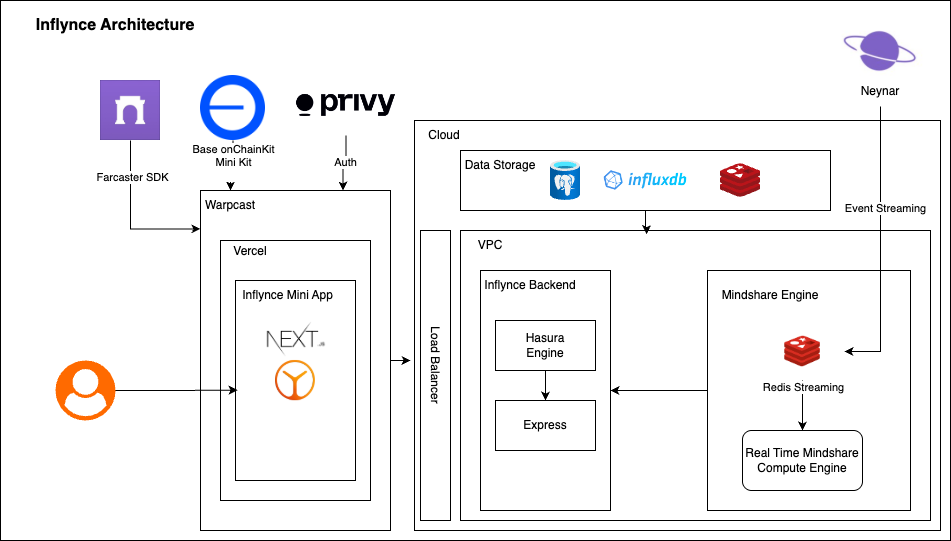

# Inflynce Miniapp
Inflynce Protocol is building the intelligence layer for the decentralized internet. Likes, impressions and follower counts are no longer enough. We believe that attention should be measurable, influence should be programmable and contribution should be rewarded.

## Platform Screenshots

### Key Features
| Mindshare heatmap | Trend analysis | Leaderboard | User Profile |
|:---:|:---:|:---:|:---:|
|  |  |  |  |

| Daily reward system | NFT sharing | NFT showcase | NFT Mint |
|:---:|:---:|:---:|:---:|
|   |  |  |  |

## Quick Reference
- [About Inflynce Protocol](#about-inflynce-protocol)
- [Technical Stack](#technical-stack)
- [Inflynce Architecture](#inflynce-architecture)
- [FAQ](#faq)
  - [What is Inflynce Protocol?](#what-is-inflynce-protocol)
  - [How are mindshare scores calculated?](#how-are-mindshare-scores-calculated)
  - [What are Inflynce Points (IP)?](#what-are-inflynce-points-ip)
  - [What can I do with IP?](#what-can-i-do-with-ip)
  - [What is "Prediction" at Inflynce?](#what-is-prediction-at-inflynce)
  - [How does "Prediction" work?](#how-does-prediction-work)
- [Contact](#contact)

## About Inflynce Protocol

Inflynce Protocol is building the intelligence layer for the decentralized internet. Likes, impressions and follower counts are no longer enough. We believe that attention should be measurable, influence should be programmable and contribution should be rewarded. 

That's why we created the InfoFi protocol - a stack that quantifies engagement, predicts mindshare and powers incentive models across Farcaster.

We are not a platform. We are the infrastructure. Our mission is to help communities move from chaos to clarity - from speculation to signal.

Inflynce Protocol is where AI meets Web3 governance. Where reputation becomes capital. Where you finally know who matters - and why.

## Technical Stack

Our platform leverages Coinbase's onChainKit to provide a seamless Web3 experience, allowing users to interact with the Inflynce Protocol without the typical friction of blockchain applications. The Base minikit enables us to build a lightweight yet powerful application that maintains full compatibility with the Base ecosystem.

### Core Technologies
- **Coinbase onChainKit**: Comprehensive toolkit for Web3 integration
  - **Base minikit**: Lightweight framework for building Base-compatible dApps
  - **Wallet SDK**: Seamless wallet connection with support for Coinbase Wallet and other providers
  - **Transaction Management**: Simplified transaction building, signing, and monitoring
  - **NFTMintCard**: NFT minting card for early inflyncers
- **Farcaster Protocol**: Deep integration with Farcaster's social graph for data collection and analysis
- **Farcaster SDK**: SDK for Farcaster's social graph for data collection and analysis
- **Next.js**: React framework for building the frontend application with server-side rendering
- **TypeScript**: Type-safe programming for robust application development
- **Material UI (MUI)**: Component library for consistent, responsive design with Material Design principles

### AI & Data Processing
- **Custom AI Engine**: Proprietary algorithms for mindshare calculation and influence prediction
- **InfluDB**: Proprietary data storage and processing system for influence metrics
- **Real-time Analytics**: Processing engagement metrics and social signals at scale
- **GraphQL API**: Flexible data querying for frontend components
- **Hasura**: GraphQL engine for database access and real-time subscriptions

### Web3 Integration
- **Base Network**: Built on Base L2 for fast, low-cost transactions
- **Coinbase Wallet NFT Services**: Seamless NFT integration for user collections
- **NFT Standards**: ERC-721 implementation for digital collectibles

### Infrastructure
- **Vercel**: Deployment and hosting platform
- **PostgreSQL**: Robust relational database for structured data storage
- **Redis**: In-memory data structure store for caching and real-time features
- **Kubernetes (kubectl)**: Container orchestration for scalable, resilient deployment
- **Docker**: Containerization for consistent development and production environments
- **InfluDB**: Proprietary data storage and processing system for influence metrics

## Inflynce Architecture

## FAQ

### What is Inflynce Protocol?
Inflynce Protocol is a decentralized coordination layer for social influence. Instead of trading tokens, you engage with real behavior: predicting which users' reputations will rise or fall - powered by our AI-driven Mindshare Algorithm.

### How are mindshare scores calculated?
We use a proprietary scoring model that analyzes post quality and engagement patterns. Each action (like, repost, mention) feeds into our AI engine to calculate a real-time, percentile-based influence score.

### What are Inflynce Points (IP)?
Inflynce Points are off-chain units used within the protocol's economy. Every day, 1,000 IPs are distributed to users based on their mindshare performance. You can earn more by completing daily tasks and winning predictions.

### What can I do with IP?
You use IP to predict on other users. If you believe someone is gaining influence, you boost them. If not, you fade them. Each prediction costs IP but smart predictors earn more when their predictions align with real outcomes.

### What is "Prediction" at Inflynce?
At Inflynce, a prediction is a reputation forecast. You're not voting based on popularity - you're signaling who you believe will rise or fall in influence based on real engagement trends.

When you use Inflynce Points (IP) to predict someone's momentum, you're actively shaping visibility across the network.
- Boosting means you believe their mindshare will grow.
- Fading means you expect their influence to decline.

Smart predictions earn you more IP. Inaccurate ones cost you. It's not a popularity contest. It's a social reputation market - powered by behavior, not hype.

### How does "Prediction" work?
Predict Reputation. Earn Inflynce Points. Shape Visibility.

**a. Watch the Signals**
Every user on Farcaster has a live Mindshare Score, calculated by our AI engine. The score reflects real-time engagement, content quality and interaction velocity across the network. You can explore heatmaps, trend charts and leaderboards - all updating continuously.

**b. Make a Prediction**
Use your Inflynce Points (IP) to boost or fade any user based on their current performance.
- Boost = You believe their mindshare will increase
- Fade = You believe their visibility will decline

You choose how much IP to commit. The more accurate your predictions, the more IP you earn. Predictions are open every Monday to Wednesday, forecasting who will rise or fall in the 7-day cycle ahead.

**c. Let the Network Move**
Mindshare Scores evolve constantly based on verified engagement data. Your predictions are tracked silently in the background.

Each week, you'll be able to review:
- Who you boosted or faded
- Whether they moved in the direction you predicted
- How much IP you earned from accurate calls

At the end of each cycle, scores are finalized - and users on the winning side share rewards from the losing pool.

**d. Earn & Climb**
Successful predictions increase your own predictor reputation and reward you with bonus Inflynce Points. You can use earned IP to climb the leaderboard, complete quests and make bolder moves in the next round.

This isn't a financial bet, it's a reputation economy where accuracy earns visibility. Every action moves the social graph and shapes who gets seen.

## Contact

Want to collaborate, invest or build with us?

### Telegram
→ [https://t.me/alitiknazoglu](https://t.me/alitiknazoglu)

### Twitter
→ [https://x.com/inflynce](https://x.com/inflynce)

### Farcaster
→ [https://warpcast.com/inflynce](https://warpcast.com/inflynce)

We are lean, transparent and always open to building with aligned teams.

**Let's shape the InfoFi era - together.**

For more information, please visit our website: https://www.inflynce.com (coming soon) 
